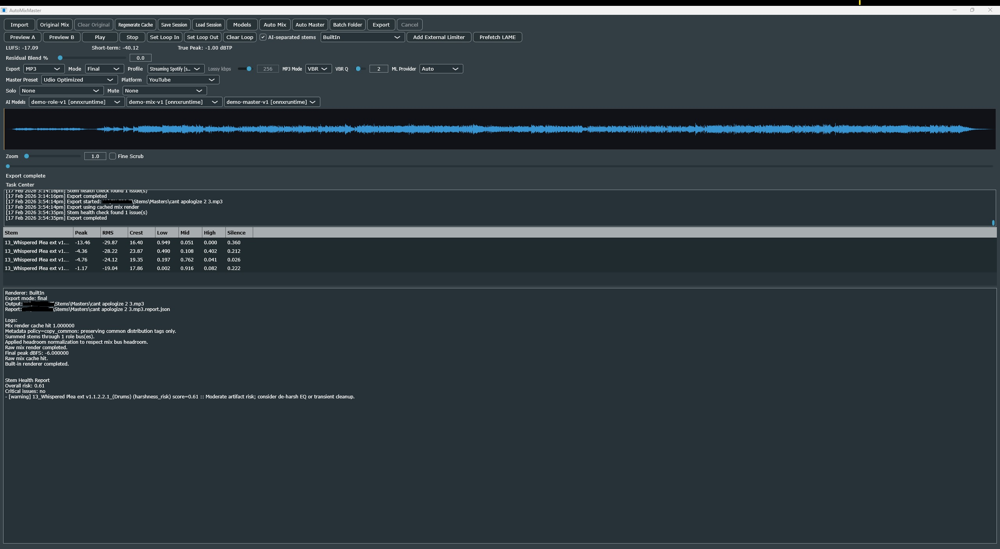

<div align="center">

# AutoMixMaster

**Version 0.4.2**




**FIXED-RULE AUDIO WORKFLOW FOR MIXING AND MASTERING MUSIC STEMS**

***Designed for amateur music producers and hobbyists***

</div>

<p align="center">
<a href="#overview">Overview</a> •
<a href="#feature-set">Feature Set</a> •
<a href="#first-session">First Session</a> •
<a href="#quick-start">Quick Start</a> •
<a href="#estimated-system-requirements">System Requirements</a> •
<a href="#build--install">Build + Install</a> •
<a href="#licensing">Licensing</a>
</p>

---

## Overview

AutoMixMaster helps you turn raw stems into a cleaner, release-ready track with fewer manual steps.

It focuses on predictable, fixed-rule processing so results are repeatable and beginner-friendly, with optional extras like AI stem separation, batch mode, and bundled renderer integrations.

---

## Feature Set

> **Core capabilities at a glance**

| Module | Description |
| :--- | :--- |
| **Auto Mix + Auto Master** | Deterministic stem balancing, gain staging, and limiting workflow. |
| **One-Click Pipeline** | `Mix + Master` (`Ctrl+Shift+M`) runs Auto Mix → Auto Master → Export. |
| **AI Stem Separation (Optional)** | Splits a single full-mix import into stems before processing when enabled. |
| **Task-Scoped Model Browser** | Install/uninstall models and set active packs per task (`mix`, `master`, `analysis`, `separation`) from Hugging Face or GitHub Releases. |
| **Batch Processing** | Queue folders, auto-group stems by filename role patterns, and render one mastered song per group (`<song>_AutoMixMaster_YYYYMMDD_XX.<ext>`). Supports recursive discovery via UI toggle or `AUTOMIX_BATCH_RECURSIVE=1`. |
| **Renderer Integrations** | Built-in discovery for PhaseLimiter, FFmpeg, SoX, and rsgain; only available tools are shown (`*_BIN` env overrides supported). |
| **Verification Reporting** | Export verification report plus batch completion summary; optional per-export `.report.json` sidecar. |
| **Task Center + Logs** | Real-time progress tracking with timestamped activity log and copy-log utility. |
| **Analysis Meters** | Live LUFS and peak metering via GlowMeters. |

---

## First Session

Welcome to your first mixing and mastering session. AutoMixMaster simplifies the process into a few core steps:

1. **Import audio**: Drag and drop files onto the waveform area, or click `Import`. Supported formats: WAV, AIFF, FLAC, MP3, OGG.
2. **(Optional) enable AI Stem Separation**: Toggle **AI Stem Separation** and check the badge beside it (`Separation model: <name/none>`).  
   - If exactly one full-mix track is loaded, separation runs before Auto Mix.  
   - If multiple files are loaded, they are treated as regular stems and separation is skipped.
3. **Manage models in Model Browser**: Open **Models** to fetch catalog entries, install/uninstall models, and set active packs per task (`mix`, `master`, `analysis`, `separation`) using **Set Active** or **Use Selected for Task**.
4. **Auto Mix**: Click **Auto Mix** to analyze stems and apply deterministic balancing rules.
5. **Auto Master**: Click **Auto Master** to apply mastering strategy and limiting.
6. **One-click pipeline**: Click **Mix + Master** (`Ctrl+Shift+M`) to run Auto Mix → Auto Master → Export. If AI Stem Separation is enabled and one full mix is loaded, separation is performed first, then the pipeline continues automatically.
7. **Export**: Use **Export** (`Ctrl+E`) for manual output control, or rely on pipeline export.

---

## Quick Start

Getting started with AutoMixMaster is simple.

> ⚠️ **Testing disclaimer:** only the **Windows** version has been manually tested end-to-end so far.  
> Linux, macOS, and ARM64 artifacts are currently provided as best-effort builds.

### Windows (Pre-compiled Executable)

Windows users can download the portable release zip (`AutoMixMaster-windows-<arch>.zip`), extract it, and run `AutoMixMaster.exe`.

### macOS (Pre-compiled App Bundle)

macOS users can download the release zip (`AutoMixMaster-macos-<arch>.zip`), extract it, and open `AutoMixMaster.app`.

### Linux (Prebuilt Packages)

Linux users can download either:

- **AppImage** (`AutoMixMaster-<version>-<arch>.AppImage`) for a portable one-file launch.
- **Debian package** (`automixmaster_<version>_<arch>.deb`) for Ubuntu/Debian install.
- **Flatpak bundle** (`AutoMixMaster-linux-<arch>.flatpak`) for Flatpak-based installs.

### Build From Source

If you are on Linux, or prefer to build the application from source on Windows, refer to the [Build + Install](#build--install) section below for verified instructions.

## Estimated System Requirements

These are **practical estimates** for AI-heavy workflows (especially ONNX-based separation/mix/master inference), not strict hard limits.

AutoMixMaster is designed to benefit from **GPU acceleration** via ONNX Runtime providers.

### Minimum OS requirements (release artifacts)

- **Windows:** **Windows 10 or Windows 11** (x64 or ARM64)
- **macOS (Apple Silicon / ARM64):** **macOS 14+**
- **macOS (Intel / x64):** **macOS 15+**
- **Linux:** **Ubuntu 24.04 LTS+** for current prebuilt `.deb`/AppImage artifacts

> Note: Ubuntu 22.04 may still work if you build from source on 22.04 with compatible dependencies, but official CI/release packaging currently targets Ubuntu 24.04.

### Minimum workable

- **CPU:** modern **6-core / 12-thread** desktop CPU (Ryzen 5 5600 / Core i5-12400 class)
- **RAM:** **16 GB minimum**
- **GPU:** compatible acceleration path with ~**6 GB VRAM**
  - Windows DirectML path: **DirectX 12-capable GPU**
  - CUDA path: **NVIDIA CUDA-capable GPU**
- **Storage:** ~10 GB free (models, temp files, exports)

### Recommended (smoother)

- **CPU:** **8 cores / 16 threads or better** (Ryzen 7 / Core i7 class)
- **RAM:** **32 GB**
- **GPU:** **8–12 GB VRAM**

### Heavy batch / long sessions

- **CPU:** **12 cores+** strongly recommended
- **RAM:** **32–64 GB**
- **GPU:** **12 GB+ VRAM**

### Why these estimates

- GPU acceleration matters most: DirectML needs a **DirectX 12** GPU and CUDA needs an **NVIDIA CUDA-capable** GPU ([DirectML](https://onnxruntime.ai/docs/execution-providers/DirectML-ExecutionProvider.html), [CUDA](https://onnxruntime.ai/docs/execution-providers/CUDA-ExecutionProvider.html)).
- Demucs notes roughly **3 GB minimum** and around **7 GB typical** GPU memory, so **8 GB+ VRAM** is a safer real-world target; CPU-only runs work but are slower ([Demucs README](https://github.com/facebookresearch/demucs/blob/main/README.md)).

---

## Build + Install

### Windows (Visual Studio 2026)

1. Configure

```bash
cmake -S . -B build -G "Visual Studio 18 2026" -A x64
```

1. Build

```bash
cmake --build build --config Release --parallel
```

### Ubuntu Linux (24.04+)

1. Install dependencies

```bash
sudo apt-get install -y \
  libasound2-dev libfreetype6-dev libx11-dev libxcomposite-dev \
  libxcursor-dev libxext-dev libxinerama-dev libxrandr-dev \
  libxrender-dev libwebkit2gtk-4.1-dev libglu1-mesa-dev mesa-common-dev
```

1. Configure + build

```bash
cmake -S . -B build -DCMAKE_BUILD_TYPE=Release
cmake --build build --parallel
```

1. Run tests (optional but recommended)

```bash
ctest --test-dir build --output-on-failure
```

### macOS (Apple Silicon + Intel)

1. Install build tools

```bash
xcode-select --install
brew install cmake ninja
```

1. Configure + build (pick one architecture)

```bash
# Apple Silicon (arm64)
cmake -S . -B build -DCMAKE_BUILD_TYPE=Release -DCMAKE_OSX_ARCHITECTURES=arm64 -DBUILD_TESTING=OFF -DBUILD_TOOLS=OFF

# Intel (x64)
cmake -S . -B build -DCMAKE_BUILD_TYPE=Release -DCMAKE_OSX_ARCHITECTURES=x86_64 -DBUILD_TESTING=OFF -DBUILD_TOOLS=OFF

cmake --build build --target AutoMixMasterApp --parallel
```

1. Configure + build (universal binary: arm64 + x86_64)

```bash
cmake -S . -B build-universal \
  -DCMAKE_BUILD_TYPE=Release \
  -DCMAKE_OSX_ARCHITECTURES="arm64;x86_64" \
  -DBUILD_TESTING=OFF \
  -DBUILD_TOOLS=OFF

cmake --build build-universal --target AutoMixMasterApp --parallel
```

1. Install app bundle

```bash
APP_BUNDLE="$(find build build-universal -maxdepth 6 -type d -name 'AutoMixMaster.app' 2>/dev/null | head -n 1)"
cp -R assets "$APP_BUNDLE/Contents/MacOS/assets"
sudo cp -R "$APP_BUNDLE" /Applications/
open /Applications/AutoMixMaster.app
```

### Linux Package Builds (.deb + AppImage)

After building, create distributable Linux packages with:

```bash
./tools/package_linux.sh
```

Output artifacts are written to `dist/linux/`.

### Flatpak

Manifest path:

`packaging/flatpak/io.automixmaster.AutoMixMaster.yml`

> Note: the Flatpak manifest prefetches JUCE/nlohmann/libebur128 sources and passes `FETCHCONTENT_SOURCE_DIR_*` flags so CMake does not need live GitHub access inside the Flatpak sandbox.

Install Flatpak tooling:

```bash
sudo apt-get install -y flatpak flatpak-builder
```

Add Flathub and install required runtime/SDK:

```bash
flatpak remote-add --user --if-not-exists flathub https://flathub.org/repo/flathub.flatpakrepo
flatpak --user install -y flathub org.freedesktop.Platform//24.08 org.freedesktop.Sdk//24.08
```

Build bundle:

```bash
./tools/build_flatpak.sh
```

Output:

- `dist/flatpak/AutoMixMaster.flatpak`

### Bundled Renderer Tools (Optional)

The renderer registry can auto-discover optional CLI tools if you place binaries under:

- `assets/ffmpeg/bin/ffmpeg(.exe)` or set `FFMPEG_BIN`
- `assets/sox/bin/sox(.exe)` or set `SOX_BIN`
- `assets/rsgain/bin/rsgain(.exe)` or set `RSGAIN_BIN`

If a tool is missing, it is hidden from selectable available renderers automatically.

---

## Licensing

AutoMixMaster is distributed under the **GNU General Public License v3 (GPLv3)**.

### Core & Libraries

| Component | License | Role |
| :--- | :--- | :--- |
| JUCE 8.0.8 | AGPLv3 / Commercial | Audio & GUI Framework |
| libebur128 | MIT | EBU R128 Loudness Metering |
| nlohmann/json | MIT | JSON Serialization & Model Metadata |
| Catch2 3.7.1 | BSL-1.0 | Unit Testing Framework |
| PhaseLimiter | GPL-2.0 / Custom | Optional External Limiter |
| FFmpeg | GPL-compatible / LGPL | Optional External Audio Renderer |
| SoX | GPL-2.0-or-later | Optional External Processor |
| rsgain | BSD-2-Clause | Optional ReplayGain Tagging Stage |

### AI Model Hub & Third-Party Weights

Model weights are **not bundled** into the installer or executable binaries. Users can optionally download models on-demand through the built-in Model Hub (`ModelManager`), which preserves and displays upstream model licensing metadata (`license` / `cardData` tags):

| Model / Model Family | Upstream Author | License | Usage & Compatibility |
| :--- | :--- | :--- | :--- |
| **HTDemucs / Demucs 4-stem** | Meta Research | MIT (code), CC-BY-NC 4.0 (MUSDB18-HQ weights) | Stem Separation (Non-Commercial weights) |
| **HTDemucs 6-stem (`htdemucs_6s`)** | Meta / Community ONNX | CC-BY-NC 4.0 | 6-Stem Separation (Guitar/Piano/Drums/Bass/Vocal/Other) |
| **Denoiser (`dns64` / Speech Enhancer)** | Meta Research | CC-BY-NC 4.0 | Speech & Vocal Denoising (Non-Commercial evaluation) |
| **Whisper Tiny / Small** | OpenAI | MIT | Transcripts, Vocal Alignment & Pitch Analysis |
| **CLAP (`clap-htsat`)** | LAION | MIT | Style Retrieval & Audio Embeddings |
| **PANNs (`PANNs_CNN14`)** | Bio-DSP / Open | MIT | General Audio Tagging & Classification |

> **Non-Commercial Notice**: Models licensed under **CC-BY-NC 4.0** (such as Meta Demucs and Denoiser weights) are restricted to personal, educational, and non-commercial evaluation use. Commercial workflows can use open-source MIT-licensed models (e.g. Whisper, CLAP) or the built-in deterministic heuristic DSP engines.

