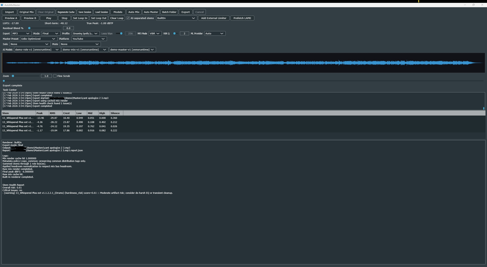

<div align="center">

# AutoMixMaster

**Version 0.4.2**




**FIXED-RULE AUDIO WORKFLOW FOR MIXING AND MASTERING MUSIC STEMS**

***Designed for amateur music producers and hobbyists***

</div>

<p align="center">
<a href="#overview">Overview</a> •
<a href="#feature-set">Feature Set</a> •
<a href="#first-session">First Session</a> •
<a href="#quick-start">Quick Start</a> •
<a href="#estimated-system-requirements">System Requirements</a> •
<a href="#build--install">Build + Install</a> •
<a href="#licensing">Licensing</a>
</p>

---

## Overview

AutoMixMaster helps you turn raw stems into a cleaner, release-ready track with fewer manual steps.

It focuses on predictable, fixed-rule processing so results are repeatable and beginner-friendly, with optional extras like AI stem separation, batch mode, and bundled renderer integrations.

---

## Feature Set

> **Core capabilities at a glance**

| Module | Description |
| :--- | :--- |
| **Auto Mix + Auto Master** | Deterministic stem balancing, gain staging, and limiting workflow. |
| **One-Click Pipeline** | `Mix + Master` (`Ctrl+Shift+M`) runs Auto Mix → Auto Master → Export. |
| **ITO-Master AI Mastering** | Experimental AI mastering strategy driving a 46-parameter native white-box FX chain with licensing consent gating. |
| **AI Stem Separation (Optional)** | Splits a single full-mix import into stems before processing when enabled (`Ctrl+Shift+A`). |
| **Task-Scoped Model Browser** | Install/uninstall models and set active packs per task (`mix`, `master`, `analysis`, `separation`) from Hugging Face or GitHub Releases. |
| **Batch Processing** | Queue folders, auto-group stems by filename role patterns, and render one mastered song per group (`<song>_AutoMixMaster_YYYYMMDD_XX.<ext>`). Supports recursive discovery via UI toggle or `AUTOMIX_BATCH_RECURSIVE=1`. |
| **Renderer Integrations** | Built-in discovery for PhaseLimiter, FFmpeg, SoX, and rsgain; only available tools are shown (`*_BIN` env overrides supported). |
| **Verification Reporting** | Export verification report plus batch completion summary; optional per-export `.report.json` sidecar. |
| **Task Center + ETA** | Real-time progress tracking with batch ETA countdown, summary status row, timestamped activity log, and copy-log utility. |
| **Transport & Audio Preview** | Realtime-safe lock-free audio preview buffer, live peak/RMS meters, 0–1.5x gain control (+3.5 dB), and modal confirmation for session clearing. |
| **Shortcuts & Commands** | `ApplicationCommandManager` integration with built-in Keyboard Shortcuts Cheatsheet modal (`?`). |
| **Analysis Meters** | Live LUFS and peak metering via GlowMeters. |

---

## First Session

Welcome to your first mixing and mastering session. AutoMixMaster simplifies the process into a few core steps:

1. **Import audio**: Drag and drop files onto the waveform area, or click `Import`. Supported formats: WAV, AIFF, FLAC, MP3, OGG.
2. **(Optional) enable AI Stem Separation**: Toggle **AI Stem Separation** and check the badge beside it (`Separation model: <name/none>`).  
   - If exactly one full-mix track is loaded, separation runs before Auto Mix.  
   - If multiple files are loaded, they are treated as regular stems and separation is skipped.
3. **Manage models in Model Browser**: Open **Models** to fetch catalog entries, install/uninstall models, and set active packs per task (`mix`, `master`, `analysis`, `separation`) using **Set Active** or **Use Selected for Task**.
4. **Auto Mix**: Click **Auto Mix** to analyze stems and apply deterministic balancing rules.
5. **Auto Master**: Click **Auto Master** to apply mastering strategy and limiting.
6. **One-click pipeline**: Click **Mix + Master** (`Ctrl+Shift+M`) to run Auto Mix → Auto Master → Export. If AI Stem Separation is enabled and one full mix is loaded, separation is performed first, then the pipeline continues automatically.
7. **Export**: Use **Export** (`Ctrl+E`) for manual output control, or rely on pipeline export.

---

## Quick Start

Getting started with AutoMixMaster is simple.

> ⚠️ **Testing disclaimer:** only the **Windows** version has been manually tested end-to-end so far.  
> Linux, macOS, and ARM64 artifacts are currently provided as best-effort builds.

### Windows (Pre-compiled Executable)

Windows users can download the portable release zip (`AutoMixMaster-windows-<arch>.zip`), extract it, and run `AutoMixMaster.exe`.

### macOS (Pre-compiled App Bundle)

macOS users can download the release zip (`AutoMixMaster-macos-<arch>.zip`), extract it, and open `AutoMixMaster.app`.

### Linux (Prebuilt Packages)

Linux users can download either:

- **AppImage** (`AutoMixMaster-<version>-<arch>.AppImage`) for a portable one-file launch.
- **Debian package** (`automixmaster_<version>_<arch>.deb`) for Ubuntu/Debian install.
- **Flatpak bundle** (`AutoMixMaster-linux-<arch>.flatpak`) for Flatpak-based installs.

### Build From Source

If you are on Linux, or prefer to build the application from source on Windows, refer to the [Build + Install](#build--install) section below for verified instructions.

## Estimated System Requirements

These are **practical estimates** for AI-heavy workflows (especially ONNX-based separation/mix/master inference), not strict hard limits.

AutoMixMaster is designed to benefit from **GPU acceleration** via ONNX Runtime providers.

### Minimum OS requirements (release artifacts)

- **Windows:** **Windows 10 or Windows 11** (x64 or ARM64)
- **macOS (Apple Silicon / ARM64):** **macOS 14+**
- **macOS (Intel / x64):** **macOS 15+**
- **Linux:** **Ubuntu 24.04 LTS+** for current prebuilt `.deb`/AppImage artifacts

> Note: Ubuntu 22.04 may still work if you build from source on 22.04 with compatible dependencies, but official CI/release packaging currently targets Ubuntu 24.04.

### Minimum workable

- **CPU:** modern **6-core / 12-thread** desktop CPU (Ryzen 5 5600 / Core i5-12400 class)
- **RAM:** **16 GB minimum**
- **GPU:** compatible acceleration path with ~**6 GB VRAM**
  - Windows DirectML path: **DirectX 12-capable GPU**
  - CUDA path: **NVIDIA CUDA-capable GPU**
- **Storage:** ~10 GB free (models, temp files, exports)

### Recommended (smoother)

- **CPU:** **8 cores / 16 threads or better** (Ryzen 7 / Core i7 class)
- **RAM:** **32 GB**
- **GPU:** **8–12 GB VRAM**

### Heavy batch / long sessions

- **CPU:** **12 cores+** strongly recommended
- **RAM:** **32–64 GB**
- **GPU:** **12 GB+ VRAM**

### Why these estimates

- GPU acceleration matters most: DirectML needs a **DirectX 12** GPU and CUDA needs an **NVIDIA CUDA-capable** GPU ([DirectML](https://onnxruntime.ai/docs/execution-providers/DirectML-ExecutionProvider.html), [CUDA](https://onnxruntime.ai/docs/execution-providers/CUDA-ExecutionProvider.html)).
- Demucs notes roughly **3 GB minimum** and around **7 GB typical** GPU memory, so **8 GB+ VRAM** is a safer real-world target; CPU-only runs work but are slower ([Demucs README](https://github.com/facebookresearch/demucs/blob/main/README.md)).

### ONNX Runtime

ONNX Runtime is an **optional** dependency. When it is not found at configure time the build
falls back to a deterministic adapter and every model-dependent feature degrades to a
heuristic — it does not fail the build. See [docs/ito-master-validation.md](docs/ito-master-validation.md).

| | |
|---|---|
| Validated against | **ORT 1.30.x** (1.30.0, 2026-09-10) |
| Minimum for the optional GPU paths | **1.22** |
| Release cadence | roughly monthly — pin a minor series, not a patch |

The build locates ONNX Runtime with `find_path`/`find_library` and applies **no** version
constraint, so any installed SDK is used. Pin deliberately if you are validating a release.

#### Provider status (as of 1.30.x)

| Provider | Status | Notes |
|---|---|---|
| **CPU** | always available | The baseline. Every GPU path falls back here on OOM or device loss, so the app never loses inference capability. |
| **CUDA** | current | Default packages target **CUDA 13.0** since 1.27. CUDA 12.8 packages are deprecated but still published through 1.30. cuDNN is optional at runtime from 1.28. |
| **DirectML** | maintenance mode | The `Microsoft.ML.OnnxRuntime.DirectML` NuGet is **frozen at 1.24.4** and caps at **opset ≤ 20**. It will not gain newer opsets, so prefer the options below for new work. |
| **CoreML** | current | Also covers the **Apple Neural Engine** — there is no separate ANE provider. ANE-specific work goes through CoreML. |
| **OpenVINO** | split | Legacy wheel pinned at 1.24.1; the plugin `onnxruntime-ep-openvino` 1.7.0 requires ORT ≥ 1.23. |
| **Windows ML** | GA (2025-09-23) | The recommended path for new Windows work. C++ needs the **self-contained** NuGet; framework-dependent C/C++ packages are not published. |
| **WebGPU** | preview | Native plugin EP, v0.4.0. |

AutoMixMaster probes available providers and walks its own priority chain — **ANE → CoreML →
CUDA → OpenVINO → DirectML → CPU** (`src/ai/GpuProvider.h`). If session creation or inference
fails, the provider is recorded as failed and the chain continues, so a broken or missing GPU
runtime degrades to CPU instead of failing the render.

> **fp16 caveat:** the CPU execution provider does not run fp16 graphs. Quantize to int8 (QDQ
> format) for CPU-only deployment; 16-bit and 4-bit quantization additionally require **opset ≥ 21**.

#### Optional runtime capabilities

Two further runtime paths are detected at configure time and are **off unless the installed
ONNX Runtime exposes the matching API**. The provider priority chain above is unchanged either
way, and both features default to off.

| Capability | Compile guard | Minimum ORT | Status |
|---|---|---|---|
| CUDA provider supplied as a plugin library | `AUTOMIX_HAS_EP_PLUGIN` | 1.23 | Policy implemented; the `RegisterExecutionProviderLibrary` call is not yet wired |
| Per-GPU compiled-model cache (EPContext) | `AUTOMIX_HAS_EP_CONTEXT` | 1.22 | Policy implemented; the `OrtCompileApi` call is not yet wired |

`src/ai/GpuProvider.h` holds the deciding logic for both — `parseOrtVersion`,
`supportsEpPlugin`, `supportsEpContext`, `decidePluginEpAttempt` and
`compiledModelCacheKey` — as pure functions, so it is covered by the test suite even on a
build with no ONNX Runtime SDK present. The cache key covers the model digest, the provider,
the GPU architecture, the driver version and the ORT version, so recompiling for a different
card or driver can never reuse another card's artifact. A model digest that is not a valid
64-character SHA-256 yields no key at all, because a key that cannot distinguish two models
would alias their caches.

To finish the wiring, the guarded code should ask `decidePluginEpAttempt(...)` and, when it
returns `attempt == false`, log its `reason` and continue down the existing priority chain;
`Ort::GetAvailableProviders()` already covers every built-in provider.


---

## Build + Install

### Windows (Visual Studio 2026)

1. Configure

```bash
cmake -S . -B build -G "Visual Studio 18 2026" -A x64
```

1. Build

```bash
cmake --build build --config Release --parallel
```

### Ubuntu Linux (24.04+)

1. Install dependencies

```bash
sudo apt-get install -y \
  libasound2-dev libfreetype6-dev libx11-dev libxcomposite-dev \
  libxcursor-dev libxext-dev libxinerama-dev libxrandr-dev \
  libxrender-dev libwebkit2gtk-4.1-dev libglu1-mesa-dev mesa-common-dev
```

1. Configure + build

```bash
cmake -S . -B build -DCMAKE_BUILD_TYPE=Release
cmake --build build --parallel
```

1. Run tests (optional but recommended)

```bash
ctest --test-dir build --output-on-failure
```

### macOS (Apple Silicon + Intel)

1. Install build tools

```bash
xcode-select --install
brew install cmake ninja
```

1. Configure + build (pick one architecture)

```bash
# Apple Silicon (arm64)
cmake -S . -B build -DCMAKE_BUILD_TYPE=Release -DCMAKE_OSX_ARCHITECTURES=arm64 -DBUILD_TESTING=OFF -DBUILD_TOOLS=OFF

# Intel (x64)
cmake -S . -B build -DCMAKE_BUILD_TYPE=Release -DCMAKE_OSX_ARCHITECTURES=x86_64 -DBUILD_TESTING=OFF -DBUILD_TOOLS=OFF

cmake --build build --target AutoMixMasterApp --parallel
```

1. Configure + build (universal binary: arm64 + x86_64)

```bash
cmake -S . -B build-universal \
  -DCMAKE_BUILD_TYPE=Release \
  -DCMAKE_OSX_ARCHITECTURES="arm64;x86_64" \
  -DBUILD_TESTING=OFF \
  -DBUILD_TOOLS=OFF

cmake --build build-universal --target AutoMixMasterApp --parallel
```

1. Install app bundle

```bash
APP_BUNDLE="$(find build build-universal -maxdepth 6 -type d -name 'AutoMixMaster.app' 2>/dev/null | head -n 1)"
cp -R assets "$APP_BUNDLE/Contents/MacOS/assets"
sudo cp -R "$APP_BUNDLE" /Applications/
open /Applications/AutoMixMaster.app
```

### Linux Package Builds (.deb + AppImage)

After building, create distributable Linux packages with:

```bash
./tools/package_linux.sh
```

Output artifacts are written to `dist/linux/`.

### Flatpak

Manifest path:

`packaging/flatpak/io.automixmaster.AutoMixMaster.yml`

> Note: the Flatpak manifest prefetches JUCE/nlohmann/libebur128 sources and passes `FETCHCONTENT_SOURCE_DIR_*` flags so CMake does not need live GitHub access inside the Flatpak sandbox.

Install Flatpak tooling:

```bash
sudo apt-get install -y flatpak flatpak-builder
```

Add Flathub and install required runtime/SDK:

```bash
flatpak remote-add --user --if-not-exists flathub https://flathub.org/repo/flathub.flatpakrepo
flatpak --user install -y flathub org.freedesktop.Platform//24.08 org.freedesktop.Sdk//24.08
```

Build bundle:

```bash
./tools/build_flatpak.sh
```

Output:

- `dist/flatpak/AutoMixMaster.flatpak`

### Bundled Renderer Tools (Optional)

The renderer registry can auto-discover optional CLI tools if you place binaries under:

- `assets/ffmpeg/bin/ffmpeg(.exe)` or set `FFMPEG_BIN`
- `assets/sox/bin/sox(.exe)` or set `SOX_BIN`
- `assets/rsgain/bin/rsgain(.exe)` or set `RSGAIN_BIN`

If a tool is missing, it is hidden from selectable available renderers automatically.

---

## Licensing

AutoMixMaster is distributed under the **GNU General Public License v3 (GPLv3)**.

### Core & Libraries

| Component | License | Role |
| :--- | :--- | :--- |
| JUCE 8.0.8 | AGPLv3 / Commercial | Audio & GUI Framework |
| libebur128 | MIT | EBU R128 Loudness Metering |
| nlohmann/json | MIT | JSON Serialization & Model Metadata |
| Catch2 3.7.1 | BSL-1.0 | Unit Testing Framework |
| PhaseLimiter | GPL-2.0 / Custom | Optional External Limiter |
| FFmpeg | GPL-compatible / LGPL | Optional External Audio Renderer |
| SoX | GPL-2.0-or-later | Optional External Processor |
| rsgain | BSD-2-Clause | Optional ReplayGain Tagging Stage |

### AI Model Hub & Third-Party Weights

Model weights are **not bundled** into the installer or executable binaries. Users can optionally download models on-demand through the built-in Model Hub (`ModelManager`), which preserves and displays upstream model licensing metadata (`license` / `cardData` tags):

| Model / Model Family | Upstream Author | License | Usage & Compatibility |
| :--- | :--- | :--- | :--- |
| **HTDemucs / Demucs 4-stem** | Meta Research | MIT (code), CC-BY-NC 4.0 (MUSDB18-HQ weights) | Stem Separation (Non-Commercial weights) |
| **HTDemucs 6-stem (`htdemucs_6s`)** | Meta / Community ONNX | CC-BY-NC 4.0 | 6-Stem Separation (Guitar/Piano/Drums/Bass/Vocal/Other) |
| **Denoiser (`dns64` / Speech Enhancer)** | Meta Research | CC-BY-NC 4.0 | Speech & Vocal Denoising (Non-Commercial evaluation) |
| **ITO-Master (`ito-master-v1`)** | Community / Open | CC-BY-NC 4.0 | AI Mastering (46-param native white-box FX chain) |
| **Whisper Tiny / Small** | OpenAI | MIT | Transcripts, Vocal Alignment & Pitch Analysis |
| **CLAP (`clap-htsat`)** | LAION | MIT | Style Retrieval & Audio Embeddings |
| **PANNs (`PANNs_CNN14`)** | Bio-DSP / Open | MIT | General Audio Tagging & Classification |

> **Non-Commercial Notice**: Models licensed under **CC-BY-NC 4.0** (such as Meta Demucs, Denoiser, and ITO-Master weights) are restricted to personal, educational, and non-commercial evaluation use. Commercial workflows can use open-source MIT-licensed models (e.g. Whisper, CLAP) or the built-in deterministic heuristic DSP engines. User consent gating is enforced prior to model download and execution.

> **Model Licensing Audit**: For complete machine-checkable model license metadata and audit reports, see [docs/model-licensing-audit.md](docs/model-licensing-audit.md) and [docs/model-licensing-audit.json](docs/model-licensing-audit.json).

#### Mix-Scope Model Contract

No curated `mix` model ships today — the AI mix path is fully wired (`AutoMixStrategyAI`), so it activates as soon as a valid mix pack is installed, and otherwise falls back to the deterministic heuristic. A downloadable mix model must satisfy all of the following:

| Requirement | Value | Enforced by |
| :--- | :--- | :--- |
| Model file | `.onnx` (**all** scopes) | `ModelPackLoader` |
| Manifest metadata | non-empty `license`, `source`, `feature_schema_version` | `ModelPackLoader` |
| `feature_schema_version` | `1.0.0` | `FeatureSchemaV1::isCompatible` |
| Required output keys | `confidence`, `global_gain_db` (±12 dB), `global_pan_bias` (±1.0) | `ModelPackLoader` + `OnnxModelInference` |
| Optional per-stem keys | `stem<N>_gain_db` (±24 dB), `stem<N>_pan` (±1.0) — a superset of the required keys | `AutoMixStrategyAI` |
| Input features | **66 floats per stem, concatenated** — `input_feature_count` must equal `66 × stem count` exactly | `OnnxModelInference::run` |
| `allowed_tasks` | must include `mix_parameters` | `OnnxModelInference::run` |

Two consequences worth knowing before authoring a pack:

- **The stem count is baked into the model's input width.** Because features are concatenated per stem, a pack trained for 4 stems (`input_feature_count: 264`) is rejected outright on a 3-stem session. A model intended for varying stem counts must accept a padded or per-stem input, not a fixed concatenation.
- **The leading public model is not plug-and-play.** `csteinmetz1/automix-toolkit` (Apache-2.0) is the best-licensed downloadable mixer — it predicts per-track gain and pan, which maps cleanly onto the `stem<N>_gain_db` / `stem<N>_pan` keys — but its published weights are PyTorch `.ckpt` checkpoints and its input is an audio encoder (log-mel/STFT), not the 66-float feature vector. Using it requires an ONNX export **and** a host-side audio-encoder frontend, so it is deliberately absent from the curated list rather than listed as broken.

#### Model Inference Contract (all scopes)

`IModelInference` is a **features-in, scalars-out** interface. A request carries one flat `std::vector<double>` (`InferenceRequest::features`); a response carries flat named scalars (`InferenceResult::outputs`). There is no audio-tensor path through it. These six tasks are the complete set:

| Task | Input | Output keys | Consumer |
| :--- | :--- | :--- | :--- |
| `mix_parameters` | 66 floats × stem count | `confidence`, `global_gain_db`, `global_pan_bias` (+ optional `stem<N>_*`) | `AutoMixStrategyAI` |
| `master_parameters` | 66 floats (the mix buffer) | `confidence`, `target_lufs`, `pre_gain_db`, `limiter_ceiling_db`, `glue_ratio` | `AutoMasterStrategyAI` |
| `role_classifier` | 66 floats per stem | `prob_vocals`, `prob_bass`, `prob_drums`, `prob_fx` | `StemRoleClassifierAI` |
| `stem_separation` | per-4096-sample-frame feature vector | `stem<N>_weight` \| `source<N>_weight` \| `mask_<N>` \| `<role>_weight` | `StemSeparator` |
| `mix_master_override` | all stems' features, concatenated | `dryWet`, `targetLufs`, `preGainDb` (legacy) | `ModelStrategy` |
| `ito_fxencoder`, `ito_predictor` | the first N stereo samples flattened channel-major into one `features` vector (encoder); the same vector with the encoder's 2048 outputs appended to it (predictor) — fed positionally, never bound by name | 2048-dim embedding, then 46 normalized chain parameters | `ItoMasterModelRunner` |

**Consequence: a model whose output is an audio-shaped tensor, or whose input needs audio semantics, cannot be used through this interface.** The wall is not the number of graph inputs — `xycld/BS-RoFormer-ONNX`, for example, has exactly one input and one output. It is two things the contract has no words for: (1) **output rank and volume** — BS-RoFormer returns a rank-5 `[1, 1, 2050, 801, 2]` float tensor (~3.3 M values), and `InferenceResult::outputs` is a `map<string, double>` that cannot carry a tensor at any rank; (2) **audio semantics on the way in** — `features` is a flat vector with no shape, no axis meaning, no channel identity, no phase and no STFT front-end, so there is no way to say "801 frames × 1025 bins × 2 channels × real/imag". That excludes essentially the whole published audio ecosystem — Demucs/HTDemucs, BS-Roformer and Mel-Band Roformer, Open-Unmix, Spleeter, Whisper, CLAP, PANNs, CED, Basic Pitch, CREPE, skey, beat-this, chordmini — regardless of license. Installing one yields a pack that validates and downloads, then either fails the `features.size() != input_feature_count` check or receives a feature vector where it expects audio.

This applies to the three **already-curated** separation models (`rysertio/Demucs-onnx`, `StemSplitio/htdemucs-ft-onnx`, `StemSplitio/htdemucs-6s-onnx`): the separator feeds them a per-frame feature vector and reads back per-stem weights, so with no weight key in the response it applies its own heuristic. `StemSeparator` now reports that case honestly — `SeparationResult::usedModel` is `false` and the log says the fallback weights were used — rather than claiming "Model-backed overlap-add separation completed".

The verified-later candidates below are held back by that single missing frontend, not by their licenses (licenses confirmed against the Hugging Face model API; all ungated):

| Model | License | Why it is not curated yet |
| :--- | :--- | :--- |
| `xycld/BS-RoFormer-ONNX` | MIT | emits a real-valued rank-5 mask tensor (real/imag on the trailing axis) that the caller multiplies against a host-side STFT; needs a tensor-level interface and an STFT front-end |
| `musetric/skey-onnx` | MIT | expects 22.05 kHz audio, not the 66-float vector |
| `musetric/chordmini-onnx` | MIT | expects a 144-bin log-CQT the host does not compute |
| `musetric/beat-this-onnx` | MIT | expects a 128-bin log-mel the host does not compute |
| `mispeech/ced-base` | Apache-2.0 | expects 16 kHz waveform input |
| Basic Pitch `nmp.onnx` | Apache-2.0 | expects a 43844-sample CQT input |

**The unblock is one interface, not a bigger catalog.** `ItoMasterModelRunner` already drives a real audio→audio→parameters graph in-process, so the pattern is proven; generalising it into a tensor-level audio interface (shaped, named float32 tensors in and out, plus a host-side STFT, alongside `IModelInference`) is what would make the entire download ecosystem reachable, and is the reason adding more curated ids before then only adds download size.


