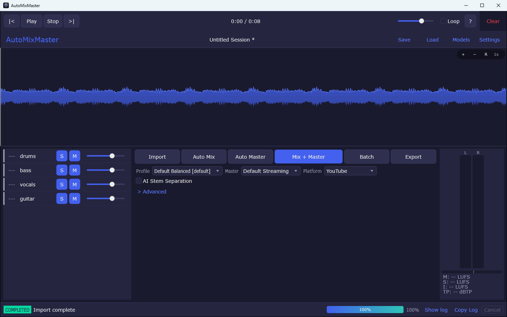
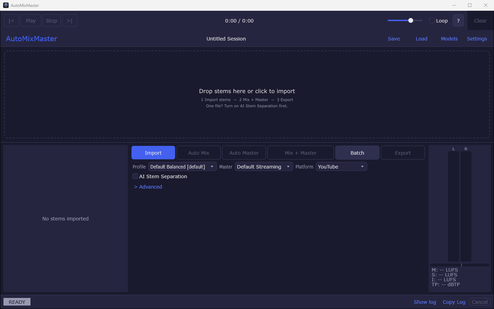

<div align="center">

# AutoMixMaster

**Version 0.5.0**



**FIXED-RULE AUDIO WORKFLOW FOR MIXING AND MASTERING MUSIC STEMS**

***Designed for amateur music producers and hobbyists***

</div>

<p align="center">
<a href="#overview">Overview</a> •
<a href="#what-it-does">What It Does</a> •
<a href="#first-session">First Session</a> •
<a href="#install">Install</a> •
<a href="#what-you-need">What You Need</a> •
<a href="#licensing">Licensing</a>
</p>

---

## Overview

Mixing and mastering take years to learn. AutoMixMaster does both with one button.

Drop in your stems. Press **Mix + Master**. Get a finished track.

The app works by fixed rules, so the same stems give the same result every time. The AI features are extras. Each one falls back to the fixed rules when you have no model installed.

<div align="center">

</div>

---

## What It Does

| Feature | What you get |
| :--- | :--- |
| **Auto Mix + Auto Master** | The app balances your stems, sets their levels and limits the result. |
| **Mix + Master** | One button (`Ctrl+Shift+M`) mixes, masters and exports. |
| **Master presets** | Default Streaming, Broadcast, Udio Optimized or Custom. |
| **Platform targets** | Spotify, Apple Music, YouTube, Amazon Music, Tidal or Broadcast EBU R128. |
| **AI Stem Separation** | Optional. Splits one full mix into stems, so you can start from a single file. |
| **Vocal Model** | Optional. BS-RoFormer pulls the vocals out of a mix. It is slow without a strong NVIDIA card. |
| **Light vocal model** | Optional. Open-Unmix is a 36 MB download for weaker machines. It is fast, and rougher. |
| **AI mastering** | Experimental. The ITO-Master model picks the mastering settings. |
| **Models window** | `Ctrl+K`. Download, remove and choose models. |
| **Batch** | Point the app at folders. It groups the stems by file name and renders one mastered song per group. |
| **Export** | WAV, AIFF, FLAC, OGG or MP3. Each export comes with a report that checks the result. |
| **Preview** | Play the mix, watch the level and loudness meters, solo or mute any stem. |
| **Sessions** | Save, load, undo and redo. The app asks before it throws away unsaved work. |
| **Progress** | A progress bar, a time estimate for batches and a log you can copy. |

### Shortcuts

| Action | Keys |
| :--- | :--- |
| Import | `Ctrl+I` |
| Auto Mix | `Ctrl+M` |
| Auto Master | `Ctrl+Shift+A` |
| Mix + Master | `Ctrl+Shift+M` |
| Export | `Ctrl+E` |
| Models | `Ctrl+K` |
| Save / Load session | `Ctrl+S` / `Ctrl+O` |
| Undo / Redo | `Ctrl+Z` / `Ctrl+Y` |
| Play / Pause | `Space` |
| Show all shortcuts | `Ctrl+/` |

---

## First Session

1. **Import your audio.** Drop files on the waveform area, click it, or press `Ctrl+I`. The app reads WAV, AIFF, FLAC, MP3 and OGG.
2. **Only one file? Turn on AI Stem Separation.** The app splits a single full mix into stems first. With several files it treats them as stems and skips this step.
3. **Press Mix + Master.** The app mixes, masters and exports.

Want more control? Run **Auto Mix**, **Auto Master** and **Export** one at a time. Pick a master preset and a platform target before you master.

---

## Install

> ⚠️ Only the **Windows** version has been tested by hand from start to finish. The Linux, macOS and ARM64 builds may have rough edges.

| System | Download | Then |
| :--- | :--- | :--- |
| **Windows** | `AutoMixMaster-windows-<arch>.zip` | Extract it and run `AutoMixMaster.exe`. |
| **macOS** | `AutoMixMaster-macos-<arch>.zip` | Extract it and open `AutoMixMaster.app`. |
| **Linux** | `.AppImage`, `.deb` or `.flatpak` | Run the AppImage, or install the package. |

**macOS:** the app is unsigned. If macOS refuses to open it, go to **System Settings → Privacy & Security** and click **Open Anyway**.

<details>
<summary><b>Build it yourself</b></summary>

### Windows (Visual Studio 2026)

```bash
cmake -S . -B build -G "Visual Studio 18 2026" -A x64
cmake --build build --config Release --parallel
ctest --test-dir build -C Release --output-on-failure
```

**Release package.** `packaging/windows/build-release.ps1` builds, runs the tests and writes a portable ZIP. Give it the CUDA build of ONNX Runtime so the package can use the GPU:

```powershell
powershell -File packaging\windows\build-release.ps1 -OnnxRuntimeDir C:\lib\onnxruntime-win-x64-gpu_cuda13-1.30.0
```

The ZIP never holds model files or NVIDIA's CUDA libraries. The install step fails if it finds one. To run a developer build on CUDA without the GPU pack, point `-DAUTOMIX_CUDA_RUNTIME_DIR` at a folder of those DLLs.

### Ubuntu Linux (24.04+)

```bash
sudo apt-get install -y \
  build-essential cmake pkg-config \
  libasound2-dev libjack-jackd2-dev libfreetype6-dev libfontconfig1-dev \
  libx11-dev libxcomposite-dev libxcursor-dev libxext-dev libxinerama-dev \
  libxrandr-dev libxrender-dev libwebkit2gtk-4.1-dev libgtk-3-dev \
  libglu1-mesa-dev mesa-common-dev libcurl4-openssl-dev

cmake -S . -B build -DCMAKE_BUILD_TYPE=Release
cmake --build build --parallel
ctest --test-dir build --output-on-failure
```

Do not skip `libcurl4-openssl-dev`. Without it the app cannot download models.

**Packages.** `./tools/package_linux.sh` writes a `.deb` and an AppImage to `dist/linux/`.

**Flatpak.**

```bash
sudo apt-get install -y flatpak flatpak-builder
flatpak remote-add --user --if-not-exists flathub https://flathub.org/repo/flathub.flatpakrepo
flatpak --user install -y flathub org.freedesktop.Platform//24.08 org.freedesktop.Sdk//24.08
./tools/build_flatpak.sh
```

The bundle lands in `dist/flatpak/AutoMixMaster.flatpak`. The manifest is `packaging/flatpak/io.automixmaster.AutoMixMaster.yml`. It fetches its sources ahead of time, so the build needs no network inside the sandbox.

### macOS (Apple Silicon + Intel)

```bash
xcode-select --install
brew install cmake ninja
```

Pick one architecture:

```bash
# Apple Silicon
cmake -S . -B build -DCMAKE_BUILD_TYPE=Release -DCMAKE_OSX_ARCHITECTURES=arm64 -DBUILD_TESTING=OFF -DBUILD_TOOLS=OFF

# Intel
cmake -S . -B build -DCMAKE_BUILD_TYPE=Release -DCMAKE_OSX_ARCHITECTURES=x86_64 -DBUILD_TESTING=OFF -DBUILD_TOOLS=OFF

cmake --build build --target AutoMixMasterApp --parallel
```

Or build for both at once:

```bash
cmake -S . -B build-universal \
  -DCMAKE_BUILD_TYPE=Release \
  -DCMAKE_OSX_ARCHITECTURES="arm64;x86_64" \
  -DBUILD_TESTING=OFF \
  -DBUILD_TOOLS=OFF

cmake --build build-universal --target AutoMixMasterApp --parallel
```

Then install the app:

```bash
APP_BUNDLE="$(find build build-universal -maxdepth 6 -type d -name 'AutoMixMaster.app' 2>/dev/null | head -n 1)"
cp -R assets "$APP_BUNDLE/Contents/MacOS/assets"
sudo cp -R "$APP_BUNDLE" /Applications/
open /Applications/AutoMixMaster.app
```

### Extra render tools

The app needs none of these. It finds them if you put them here or set the variable:

- `assets/ffmpeg/bin/ffmpeg(.exe)` or `FFMPEG_BIN`
- `assets/sox/bin/sox(.exe)` or `SOX_BIN`
- `assets/rsgain/bin/rsgain(.exe)` or `RSGAIN_BIN`

PhaseLimiter runs only when you select it, and it needs ffmpeg.

</details>

---

## What You Need

The fixed-rule mix and master run on almost any recent computer. The numbers below are for the AI features. They are estimates, not hard limits.

| | Works | Comfortable | Big batches |
| :--- | :--- | :--- | :--- |
| **Processor** | 6 cores | 8 cores | 12 cores or more |
| **Memory** | 16 GB | 32 GB | 32–64 GB |
| **Graphics memory** | 6 GB | 8–12 GB | 12 GB or more |
| **Free disk** | 10 GB | | |

**Systems the release builds support**

- **Windows** 10 or 11, x64 or ARM64
- **macOS** 14 or later on Apple Silicon; 15 or later on Intel
- **Linux:** Ubuntu 24.04 or later

**Graphics cards**

- **Windows and Linux:** an NVIDIA card is fastest. Other cards work if they support DirectX 12 or Vulkan. Linux needs `libvulkan1`.
- **Apple Silicon Macs:** the app uses the built-in graphics chip.
- **Intel Macs:** no AI features. Mixing and mastering still work.
- **No usable card:** the AI features run on the processor. They work, and they are slow.

**Macs with less than 12 GB of memory.** The Vocal Model runs slowly on them. The app warns you and points you to the light Open-Unmix model.

### The Vocal Model on an NVIDIA card (Windows)

The Vocal Model runs on your graphics card when all of this is true:

- The card has at least 12 GB of memory, with 10 GB free.
- Your NVIDIA driver is version 580 or newer.
- You have installed the **GPU pack**.

The GPU pack is a one-time download of about 1 GB. The app offers it when you switch on the Vocal Model. You can also install or remove it under **Settings → GPU acceleration**. It needs no admin rights and changes nothing else on your system.

Without these, the Vocal Model runs on the processor and the log tells you why. The difference is large: one 196-second track took 66 to 91 seconds on an RTX 5060 Ti and 687 seconds on the processor.

---

## Licensing

AutoMixMaster is free software under the **GNU General Public License v3**.

**The app ships with no AI models.** You download the ones you want from the Models window. The app shows each model's license and asks you to accept it first.

**Some models are for non-commercial use only.** If you sell your music, use the MIT-licensed models or the fixed rules.

| Model | Used for | License | Commercial use |
| :--- | :--- | :--- | :--- |
| BS-RoFormer | Vocal Model | MIT | Yes |
| Open-Unmix | Light vocal model | MIT | Yes |
| Whisper, CLAP, PANNs | Analysis | MIT | Yes |
| Demucs / HTDemucs | Stem separation | CC-BY-NC 4.0 weights | No |
| Denoiser | Vocal clean-up | CC-BY-NC 4.0 | No |
| ITO-Master | AI mastering | CC-BY-NC 4.0 | No |

The full license record for every model is in [docs/model-licensing-audit.json](docs/model-licensing-audit.json).

**Software the app is built on**

| Component | License | Role |
| :--- | :--- | :--- |
| JUCE 8.0.8 | AGPLv3 / Commercial | Audio and interface framework |
| libebur128 | MIT | Loudness metering |
| nlohmann/json | MIT | Reading and writing JSON |
| Catch2 3.7.1 | BSL-1.0 | Tests |
| PhaseLimiter | GPL-2.0 / Custom | Optional limiter |
| FFmpeg | GPL-compatible / LGPL | Optional renderer |
| SoX | GPL-2.0-or-later | Optional processor |
| rsgain | BSD-2-Clause | Optional loudness tagging |

---

## Developer Notes

Most people can stop reading here. These notes are for building against ONNX Runtime or writing a model pack.

<details>
<summary><b>ONNX Runtime and graphics providers</b></summary>

### ONNX Runtime

ONNX Runtime is optional. Without it, the build still succeeds and every model feature falls back to the fixed rules.

| | |
|---|---|
| Validated against | **ORT 1.30.x** (1.30.0, 2026-09-10) |
| Minimum for the optional GPU paths | **1.22** |
| Release cadence | roughly monthly — pin a minor series, not a patch |

The build finds ONNX Runtime with `find_package(onnxruntime 1.30.0 EXACT CONFIG)` when fetched via `AUTOMIX_FETCH_ORT=ON`, or with `find_path`/`find_library` for a system SDK.

#### Provider status (as of 1.30.x)

| Provider | Status | Notes |
|---|---|---|
| **CPU** | always available | The baseline. Every GPU path falls back here on out-of-memory or device loss. |
| **CUDA** | current | Default packages target **CUDA 13.0** since 1.27. cuDNN and the CUDA runtime load at run time when present. |
| **WebGPU** | current | A plugin provider on Windows and Linux (`Microsoft.ML.OnnxRuntime.EP.WebGpu` 0.4.0) and in-tree on Apple Silicon. The default non-NVIDIA path on Windows and Linux. Needs `libvulkan1` on Linux. |
| **CoreML** | current | Built in on macOS. Covers the **Apple Neural Engine** (`MLComputeUnits=CPUAndNeuralEngine` or `ALL`). Intel Macs run no AI inference. |
| **DirectML** | maintenance mode | The `Microsoft.ML.OnnxRuntime.DirectML` NuGet is frozen at 1.24.4 and caps at opset ≤ 20. WebGPU replaces it. |
| **OpenVINO** | split | The legacy wheel is pinned at 1.24.1. The plugin `onnxruntime-ep-openvino` 1.7.0 needs ORT ≥ 1.23. |
| **Windows ML** | GA (2025-09-23) | Recommended for new Windows work. C++ needs the self-contained NuGet. |

The app probes the providers and walks its own priority chain: **ANE → CoreML → CUDA → WebGPU → OpenVINO → DirectML → CPU** (`src/ai/GpuProvider.h`). A provider that fails is recorded and skipped. A broken GPU runtime slows the render down. It does not stop it.

> **fp16 caveat:** the CPU provider does not run fp16 graphs. Quantize to int8 (QDQ format) for CPU-only use. 16-bit and 4-bit quantization also need opset ≥ 21.

#### Optional runtime capabilities

Two more paths are detected at configure time. Both are off unless the installed ONNX Runtime exposes the matching API. Neither changes the priority chain.

| Capability | Compile guard | Minimum ORT | Status |
|---|---|---|---|
| WebGPU provider supplied as a plugin library | `AUTOMIX_HAS_EP_PLUGIN` | 1.23 | Wired for WebGPU via `OrtRuntime` and `RegisterExecutionProviderLibrary` |
| Per-GPU compiled-model cache (EPContext) | `AUTOMIX_HAS_EP_CONTEXT` | 1.22 | Policy implemented. The `OrtCompileApi` call is not wired yet. |

`src/ai/GpuProvider.h` holds the deciding logic as pure functions: `parseOrtVersion`, `supportsEpPlugin`, `supportsEpContext`, `decidePluginEpAttempt` and `compiledModelCacheKey`. The tests cover them even on a build with no ONNX Runtime SDK.

The cache key covers the model digest, the provider, the GPU architecture, the driver version and the ORT version. One card can never reuse another card's compiled model. A digest that is not a valid 64-character SHA-256 yields no key at all.

To finish the wiring, the guarded code should call `decidePluginEpAttempt(...)`. When it returns `attempt == false`, log its `reason` and continue down the chain.

</details>

<details>
<summary><b>Model pack contracts</b></summary>

### Mix-Scope Model Contract

No curated `mix` model ships today. The AI mix path is wired (`AutoMixStrategyAI`). It activates when you install a valid mix pack. Until then it uses the fixed rules.

A mix model must meet all of these:

| Requirement | Value | Enforced by |
| :--- | :--- | :--- |
| Model file | `.onnx` (**all** scopes) | `ModelPackLoader` |
| Manifest metadata | non-empty `license`, `source`, `feature_schema_version` | `ModelPackLoader` |
| `feature_schema_version` | `1.0.0` | `FeatureSchemaV1::isCompatible` |
| Required output keys | `confidence`, `global_gain_db` (±12 dB), `global_pan_bias` (±1.0) | `ModelPackLoader` + `OnnxModelInference` |
| Optional per-stem keys | `stem<N>_gain_db` (±24 dB), `stem<N>_pan` (±1.0) | `AutoMixStrategyAI` |
| Input features | **66 floats per stem, concatenated** — `input_feature_count` must equal `66 × stem count` | `OnnxModelInference::run` |
| `allowed_tasks` | must include `mix_parameters` | `OnnxModelInference::run` |

Two things to know before you author a pack:

- **The stem count is baked into the input width.** A pack trained for 4 stems (`input_feature_count: 264`) is rejected on a 3-stem session. A model for varying stem counts must accept a padded or per-stem input.
- **The leading public model is not plug-and-play.** `csteinmetz1/automix-toolkit` (Apache-2.0) predicts per-track gain and pan, which maps onto the `stem<N>_*` keys. But its weights are PyTorch `.ckpt` files and its input is an audio encoder, not the 66-float vector. It needs an ONNX export and a host-side encoder, so it is not on the curated list.

### Model Inference Contracts

The app has two inference interfaces.

**1. `IModelInference`: features in, scalars out.** A request carries one flat `std::vector<double>`. A response carries named scalars. These tasks use it:

| Task | Input | Output keys | Consumer |
| :--- | :--- | :--- | :--- |
| `mix_parameters` | 66 floats × stem count | `confidence`, `global_gain_db`, `global_pan_bias` (+ optional `stem<N>_*`) | `AutoMixStrategyAI` |
| `master_parameters` | 66 floats (the mix buffer) | `confidence`, `target_lufs`, `pre_gain_db`, `limiter_ceiling_db`, `glue_ratio` | `AutoMasterStrategyAI` |
| `role_classifier` | 66 floats per stem | `prob_vocals`, `prob_bass`, `prob_drums`, `prob_fx` | `StemRoleClassifierAI` |
| `stem_separation` | per-4096-sample-frame feature vector | `stem<N>_weight` \| `source<N>_weight` \| `mask_<N>` \| `<role>_weight` | `StemSeparator` |
| `mix_master_override` | all stems' features, concatenated | `dryWet`, `targetLufs`, `preGainDb` (legacy) | `ModelStrategy` |
| `ito_fxencoder`, `ito_predictor` | the first N stereo samples, flattened channel-major (encoder); the same vector plus the encoder's 2048 outputs (predictor) | 2048-dim embedding, then 46 normalized chain parameters | `ItoMasterModelRunner` |

This interface cannot carry audio. Its output is a `map<string, double>`, and its input has no shape, channels or phase. A model that returns an audio-shaped tensor does not fit.

The three curated Demucs models (`rysertio/Demucs-onnx`, `StemSplitio/htdemucs-ft-onnx`, `StemSplitio/htdemucs-6s-onnx`) go through this interface. They return no weight keys, so the separator applies its own fixed rules. `StemSeparator` reports that honestly: `SeparationResult::usedModel` is `false`, and the log says it used fallback weights.

**2. `ITensorInference`: shaped tensors in and out.** `OnnxTensorInference` passes named float32 tensors to ONNX Runtime. `SeparationRunner` adds a host-side STFT around it. This is how the audio models run:

| Model | Input the host builds | Output the host applies |
| :--- | :--- | :--- |
| `xycld/BS-RoFormer-ONNX` | STFT of the mix | a real/imaginary mask |
| `MixDirective/open-unmix-umxhq-vocals-onnx` | STFT magnitudes | a ratio mask; the mix phase is kept |

These candidates are still held back. Each needs a front end the host does not compute yet. Their licenses are fine (confirmed against the Hugging Face model API; all ungated):

| Model | License | What it needs |
| :--- | :--- | :--- |
| `musetric/skey-onnx` | MIT | 22.05 kHz audio input |
| `musetric/chordmini-onnx` | MIT | a 144-bin log-CQT |
| `musetric/beat-this-onnx` | MIT | a 128-bin log-mel |
| `mispeech/ced-base` | Apache-2.0 | 16 kHz waveform input |
| Basic Pitch `nmp.onnx` | Apache-2.0 | a 43844-sample CQT input |

</details>
